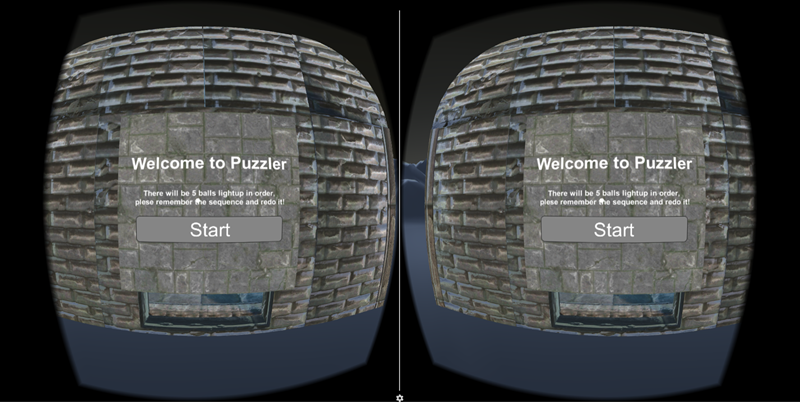
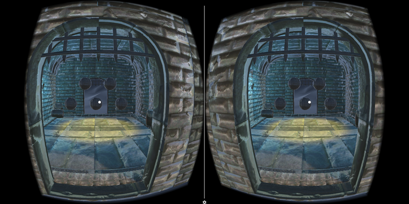
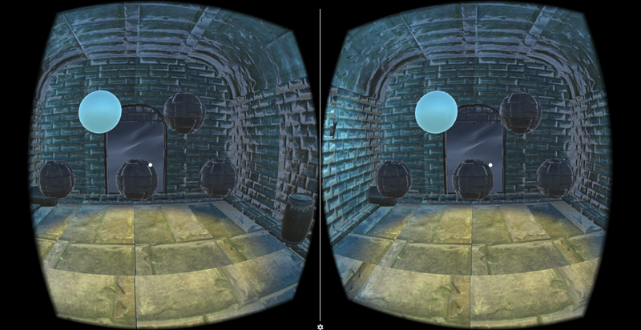

# PUZZLAR IN VR

Build with Udacity's prefar,  
complete the project and add some custom function.

--by Zidong Lin(梓栋 林)

*****************************

### Support
* Google VR SDK for Unity version: 1.0(License:Apache 2.0)
* Submitting for Android(for 4.4 'Kit Kat', API level 19)
* Virtual Reality Supported(Virtual Reality SDKs - Cardboard/None)
* EditorVersion: Unity 5.5.1f1

*****************************

### File Directory(Integrated Project(download)later will be updated)
* Assets
* Build
 - MazeVR.apk
* ProjectSettings
* ScreenShot
 - 3 Screenshot images
* README.md

*****************************
### V1.0.0 Features
* This is a puzzler project with magic ambience. In this game, you will be invited to a chamber, which is full of medieval and magical atmosphere. Without addressing the puzzler, you won’t be able to get out. The puzzler is simple. There will be 5 balls in the chamber lighted up in certain sequence after you getting in. What you have to do is to remember the sequence, and redo it. Sounds as hints will help you to address it. I hope the player enjoys this puzzler.
* The frame of the game is almost complete. It has created an medieval and magical atmosphere. In this game, the player can learn how to play in the beginning. He/she will use VR to address the puzzler, and has chance to experience the movement. It will be a good opportunity to step into a new world with immersive feeling.

